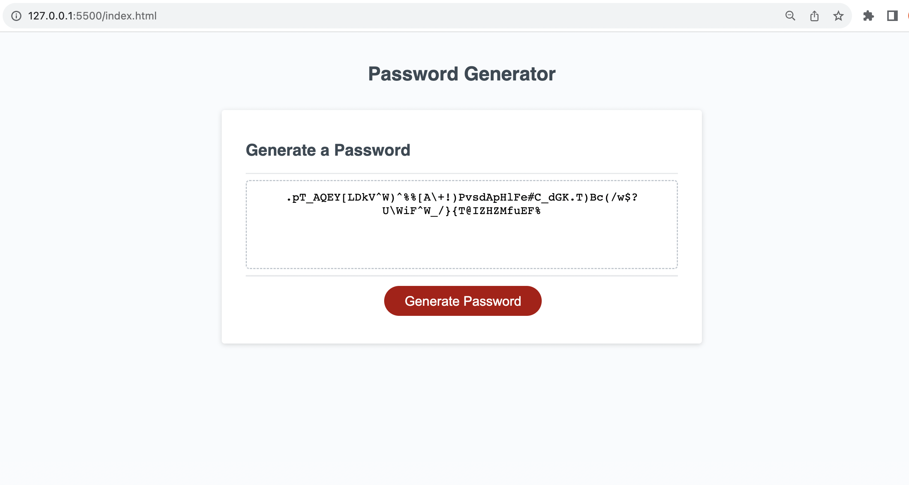

# Password-Generator

Creating an app powered by Javascript code to enable the creation of a password generator

# Description

In this challenge, specific criteria were applied to generate a random password for an employer. This was achieved by interacting with the user through a prompt, enabling the inclusion of numeric, uppercase, and lowercase characters. The "get random" function was used to select random elements from an array, and the "get password" function was employed to generate the password based on user preferences. An event listener was used to display the password when a button was clicked.

## Usage Screenshot of final product: Boostrap portfolio demo

## Link to deployed application:

## Collaborators

I worked on this challenge with Ikran Hussein GitHub: https://github.com/Ikran1

## References / Resources

https://developer.mozilla.org/en-US/docs/Web/JavaScript/Reference/Global_Objects/parseInt

https://developer.mozilla.org/en-US/docs/Web/JavaScript/Reference/Global_Objects/NaN

https://developer.mozilla.org/en-US/docs/Web/API/EventTarget/addEventListener
